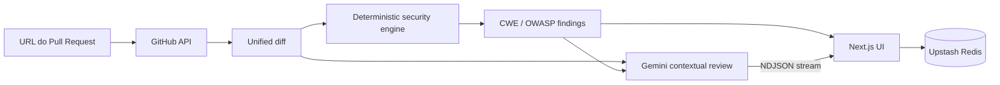

<h1 align="center">Security PR Reviewer</h1>

<p align="center">
  <strong>AppSec review for GitHub Pull Requests with deterministic rules, CWE/OWASP mapping and contextual AI analysis.</strong>
</p>

<p align="center">
  <a href="https://github.com/guuszz/pr-reviewer/actions/workflows/ci.yml"></a>
  
  
  
  <a href="LICENSE"></a>
</p>

## Visão geral

Cole a URL de um Pull Request público. O projeto busca o diff, examina **somente as linhas adicionadas**, apresenta achados reproduzíveis com `arquivo:linha` e envia esse contexto para uma segunda revisão com Gemini.

O resultado reúne:

- severidade e evidência do achado;
- regra acionada e localização exata;
- classificação **CWE** e **OWASP**;
- orientação de remediação;
- revisão contextual em streaming NDJSON;
- link compartilhável, quando Upstash Redis está configurado.

## Regras determinísticas

| Regra | Exemplo de risco | Referência |
|---|---|---|
| `SEC001` | Credencial hardcoded | CWE-798 |
| `SEC002` | AWS Access Key no diff | CWE-798 |
| `SEC003` | Execução dinâmica com `eval` | CWE-95 |
| `SEC004` | Interpolação em comando de shell | CWE-78 |
| `SEC005` | Interpolação em consulta SQL | CWE-89 |
| `SEC006` | Validação TLS desativada | CWE-295 |
| `SEC007` | CORS com origem curinga | CWE-942 |
| `SEC008` | Hash criptográfico fraco | CWE-328 |
| `SEC009` | Token gerado com `Math.random` | CWE-330 |
| `SEC010` | Dado sensível enviado ao log | CWE-532 |

O scanner ignora linhas removidas, metadados do patch e valores comuns de placeholder ou variáveis de ambiente para reduzir ruído.

## Arquitetura



## Execução local

Requisitos: Node.js 22+ e uma chave do Google AI Studio.

```bash
git clone https://github.com/guuszz/pr-reviewer.git
cd pr-reviewer
npm ci
cp .env.example .env.local
npm run dev
```

Abra `http://localhost:3000` e informe uma URL no formato:

```text
https://github.com/OWNER/REPOSITORY/pull/NUMBER
```

### Variáveis de ambiente

| Variável | Obrigatória | Uso |
|---|---:|---|
| `GOOGLE_API_KEY` | sim | Revisão contextual com Gemini |
| `GITHUB_TOKEN` | não | Aumenta o limite da GitHub API |
| `UPSTASH_REDIS_REST_URL` | não | Persistência de análises compartilhadas |
| `UPSTASH_REDIS_REST_TOKEN` | não | Autenticação do Redis |

## Qualidade e verificação

```bash
npm audit --audit-level=high
npm test
npm run typecheck
npm run build
```

A pipeline executa os mesmos quatro gates em cada Pull Request. Os testes unitários cobrem parsing de diff, linha original do achado, detecções principais, redução de falso positivo e resumo por severidade.

## Decisões técnicas

- **Determinístico antes da IA:** achados essenciais continuam verificáveis e testáveis.
- **Somente adições:** o reviewer não atribui ao PR uma vulnerabilidade que já foi removida.
- **NDJSON sobre POST:** permite enviar a URL no corpo e consumir a análise incrementalmente com `fetch`.
- **Cache e rate limit:** reduz custo e abuso sem exigir infraestrutura para desenvolvimento local.

## Roadmap

- [ ] saída SARIF para GitHub Code Scanning;
- [ ] GitHub App com comentários inline;
- [ ] integração opcional com Semgrep;
- [ ] quality gate configurável por severidade;
- [ ] exportação de achados para o RedReport.

## Uso responsável

Analise apenas Pull Requests que possam ser processados pelo serviço. Não inclua segredos em URLs, diffs, issues ou relatórios. Achados automatizados são um primeiro passe e devem receber validação humana antes de uma decisão de merge.

## Licença

[MIT](LICENSE)
