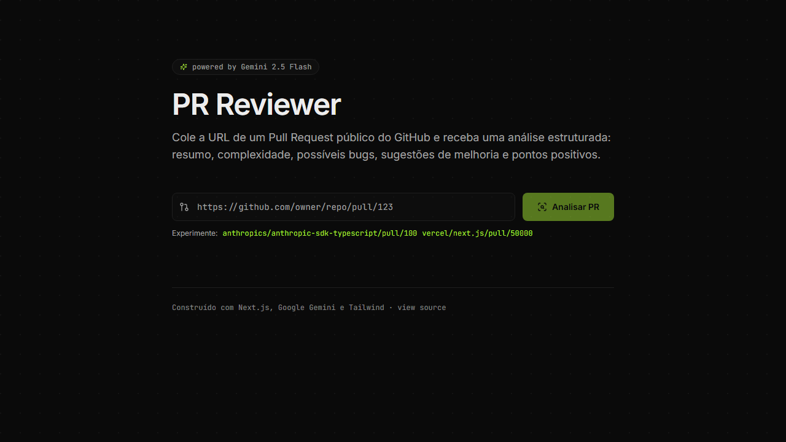

<h1 align="center">🔍 pr-reviewer</h1>

<p align="center">
  <a href="https://pr-reviewer-lemon.vercel.app">
    
  </a>
</p>

<p align="center">
  <b>Code review automático com IA pra Pull Requests do GitHub.</b><br/>
  <sub>Cole uma URL · receba análise estruturada em PT-BR em ~20s · compartilhe via link estável.</sub>
</p>

<p align="center">
  <a href="https://pr-reviewer-lemon.vercel.app"><b>🌐 Demo ao vivo →</b></a>
</p>

<p align="center">
  
  
  
  
  <a href="https://pr-reviewer-lemon.vercel.app"></a>
  <a href="LICENSE"></a>
</p>

---

## O que faz

Você cola qualquer URL de PR público do GitHub:

```
https://github.com/vercel/next.js/pull/94131
```

E em ~20 segundos recebe uma revisão estruturada em **5 seções fixas**:

```
## 📋 Resumo            ← o que esse PR faz (2-4 frases)
## ⚖️ Complexidade       ← baixa | média | alta + justificativa
## 🐛 Possíveis Bugs    ← com arquivo:linha
## 💡 Sugestões         ← melhorias concretas
## ✅ Pontos Positivos  ← boas práticas demonstradas
```

A análise vem em streaming chunk-a-chunk (igual ChatGPT), e fica salva por 30 dias num link compartilhável tipo `/r/a3f9b2e1c0` que você pode mandar pro time.

## Por que existe

Code review é caro. Ninguém quer ler PR de 500 linhas às 17h de sexta. Mas ninguém quer mergear PR sem revisar também. Esse app é o **primeiro passe automático**:

- 🧠 Pra **junior** abrindo PR: roda no próprio PR antes de pedir review humano. Acha bugs óbvios.
- 👨‍💻 Pra **sênior** revisando: 2ª opinião rápida em áreas que não conhece bem.
- 🌍 Pra **maintainer** open-source: triagem rápida de PRs de gente desconhecida.
- 🎓 Pra **estudante**: cola um PR famoso e a IA explica o que tá acontecendo.

## Quick start

```bash
git clone https://github.com/guuszz/pr-reviewer.git
cd pr-reviewer
npm install
cp .env.example .env.local           # preenche GOOGLE_API_KEY
npm run dev                          # localhost:3000
```

Pega a chave do Google grátis em [aistudio.google.com/apikey](https://aistudio.google.com/apikey).

## Como funciona (a parte interessante)

A arquitetura tem 4 ideias que valem comentar.

### 1. Por que NDJSON em vez de SSE pra streaming

O navegador tem `EventSource`, que é o cliente nativo de Server-Sent Events. **Mas EventSource não aceita POST com body** — só GET com query string. Pro pr-reviewer eu precisava mandar uma URL de PR (que poderia ser longa) no body, então SSE estava fora.

Solução: **NDJSON** (newline-delimited JSON) sobre uma `Response` normal. Cada chunk é um JSON terminado com `\n`:

```
{"type":"meta","prInfo":{...},"shareId":"a3f9b2e1c0"}
{"type":"chunk","text":"## 📋 Resumo\nEste PR..."}
{"type":"chunk","text":"\n## ⚖️ Complexidade\n..."}
{"type":"done"}
```

Backend escreve via `ReadableStream`:

```ts
const stream = new ReadableStream({
  async start(controller) {
    const encoder = new TextEncoder();
    const event = (data) => encoder.encode(JSON.stringify(data) + "\n");

    controller.enqueue(event({ type: "meta", prInfo, shareId }));

    for await (const chunk of geminiStream) {
      controller.enqueue(event({ type: "chunk", text: chunk }));
    }

    controller.enqueue(event({ type: "done" }));
    controller.close();
  },
});

return new Response(stream, {
  headers: { "Content-Type": "application/x-ndjson" },
});
```

Frontend lê via `reader.read()` + `TextDecoder` + split por `\n`:

```ts
const reader = res.body.getReader();
const decoder = new TextDecoder();
let buffer = "";

while (true) {
  const { done, value } = await reader.read();
  if (done) break;

  buffer += decoder.decode(value, { stream: true });
  let newlineIdx = buffer.indexOf("\n");
  while (newlineIdx !== -1) {
    const line = buffer.slice(0, newlineIdx).trim();
    buffer = buffer.slice(newlineIdx + 1);
    if (line) handleEvent(JSON.parse(line));
    newlineIdx = buffer.indexOf("\n");
  }
}
```

Vantagens vs SSE:

- ✅ Funciona com qualquer método HTTP (POST, PUT, etc)
- ✅ Você define seu protocolo (campos meta, chunk, error, done)
- ✅ Trivial de testar via `curl --no-buffer`
- ❌ Sem reconnect automático (mas pra esse use case não precisa)

### 2. Cache em 2 camadas

```
fetch → in-memory cache → Redis cache → GitHub + Gemini
                ↑↑↑                ↑↑↑
        ~5ms hit rate         ~50ms hit rate
        sobrevive 1h          sobrevive 30 dias
```

In-memory cache (`Map` com TTL via timestamp) é o L1: zero latência, perde no cold start. Redis (Upstash) é o L2: persistente, cross-deployment.

Quando a análise termina, salvo nos dois:

```ts
// 1. cache em memória pra próximas requests deste deploy
setCached(url, { markdown, prInfo });

// 2. Redis pra persistir entre deploys + permitir share URLs
if (isRedisConfigured()) {
  await saveSharedReview(url, { markdown, prInfo, truncated });
}
```

E em cache hit, ainda respondo via stream protocol (1 chunk único com tudo) — mantém uma única code path no frontend.

### 3. O hash da URL como ID = efeito de rede grátis

O ID do compartilhamento é `SHA-256(URL_normalizada)[:10]`. Isso significa: **o mesmo PR sempre gera o mesmo `/r/<id>`**, não importa quem analisou primeiro.

Consequência: se você analisar `vercel/next.js/pull/94131` e seu colega também, vocês compartilham o mesmo link. O segundo a acessar pega cache hit (50ms vs 20s). Quanto mais gente usa, mais rápido fica.

```ts
function shortIdFromUrl(prUrl: string): string {
  const normalized = normalizeUrl(prUrl); // host+path lowercase, sem trailing slash
  return crypto.createHash("sha256").update(normalized).digest("hex").slice(0, 10);
}
```

10 chars hex = 40 bits de espaço (~1 trilhão de IDs possíveis). Colisão é improvável até bem além da escala que esse app vai operar.

### 4. Truncamento defensivo do diff

PRs grandes podem ter diffs de 500KB+. Mandar isso pro Gemini = caro e lento. Resolução:

```ts
const DIFF_MAX_BYTES = 50_000; // ~12k tokens

if (diff.length > DIFF_MAX_BYTES) {
  diff = diff.slice(0, DIFF_MAX_BYTES) + "\n\n[... truncado pra controlar custo de tokens]";
  truncated = true;
}
```

E mando flag `truncated: true` pro frontend, que mostra badge "diff truncado" no card do PR. A análise menciona explicitamente que ela é parcial.

## Stack

| Camada | Tecnologia | Por quê |
|---|---|---|
| Framework | Next.js 14 (App Router) | Edge functions + streaming nativo + server components |
| AI | Google Gemini 2.5 Flash via `@google/generative-ai` | Free tier acessível pra contas brasileiras; `generateContentStream` nativo |
| Cache L2 | Upstash Redis via `@upstash/redis` | Vercel marketplace, free tier 10K cmds/dia, latência consistente |
| HTTP client | `fetch` nativo (sem axios) | Web standards, body como ReadableStream, smaller bundle |
| Validação | Regex inline + try/catch | Schema overhead não justifica pra 1 input |
| Markdown render | `react-markdown` + `remark-gfm` | Tabelas, checkboxes, code highlights |
| Styling | Tailwind CSS | Tokens via CSS vars, dark mode default |
| Deploy | Vercel (auto from main) | Zero config + KV/Blob integrations |

## Estrutura de arquivos

```
app/
├── api/
│   ├── analyze/route.ts        # legacy non-stream (cache JSON)
│   └── analyze/stream/route.ts # streaming NDJSON principal
├── r/[id]/page.tsx             # /r/<short-id> — revisão compartilhada (SSR)
├── page.tsx                    # form + result card
├── layout.tsx                  # OG metadata, theme
└── opengraph-image.tsx         # dynamic OG image

lib/
├── gemini.ts                   # analyzePr + analyzePrStream (AsyncGenerator)
├── github.ts                   # parsePrUrl + fetchPrData (parallel)
├── cache.ts                    # in-memory L1 cache
└── redis.ts                    # L2 cache + share IDs
```

## Variáveis de ambiente

| Var | Obrigatória | Onde pegar |
|---|---|---|
| `GOOGLE_API_KEY` | ✅ | [aistudio.google.com/apikey](https://aistudio.google.com/apikey) — grátis com conta Google |
| `KV_REST_API_URL` | ⚠️ opcional | Auto-criada quando você conecta Upstash via Vercel marketplace. Sem isso, share URLs ficam desabilitadas mas app funciona. |
| `KV_REST_API_TOKEN` | ⚠️ opcional | Idem acima |
| `GITHUB_TOKEN` | ❌ | Aumenta rate limit do GitHub de 60/h pra 5000/h. Precisa só de `public_repo` scope. |

## Roadmap

- [x] Análise via API REST com cache in-memory
- [x] Migração Anthropic → Google Gemini
- [x] Streaming NDJSON com indicador progressivo
- [x] URLs compartilháveis via Upstash Redis
- [ ] Fallback automático entre providers (Gemini → Claude → OpenAI)
- [ ] Personas selecionáveis ("revisor sênior" vs "junior friendly" vs "security focused")
- [ ] Browser extension (botão "AI Review" direto no UI do GitHub)
- [ ] Suporte a PRs privados via GitHub App
- [ ] Comparação lado-a-lado de múltiplos PRs

## Custo

**Zero pra você testar.** Os 3 providers usados têm free tiers generosos:

- Google Gemini 2.5 Flash: 15 RPM, 1M tokens/dia (free)
- Upstash Redis: 10K commands/dia (free)
- Vercel Hobby: 100GB bandwidth/mês (free)

Pra um app que pegue 1000 usuários/dia sem repetir PRs, custo total ≈ $0.

## Licença

MIT © [Gustavo Oliveira](https://github.com/guuszz)
